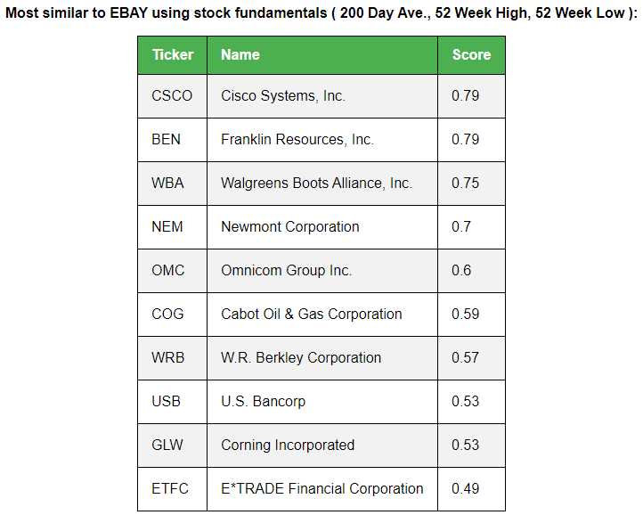

# StockRec

This code was developed for me to learn more about implementing a simple recommender system on an interesting dataset.

The code does not make predictions, but instead recommends alternative stocks based on stocks that you are interested in. You can select criteria that are important to you and the system will return similar stocks that you may wish to consider. The goal is to reduce your own research time by quickly filtering to the most 'relevant' stocks for you.

## Running the code

The code is Python 3, and has been tested on Py 3.7, Windows 10.

1. Install python packges:

```
pip install -r requirements.txt
```

2. Patch yfinance:

There are a couple of bugs in the yfinance package that causes exceptions that halt execution for many stocks. Implement a workaround in `yfinance/base.py` for a lack of holders data in lines 284-286 by adding exception handling (BRK.B is a good test for this):

```
try:
    holders = _pd.read_html(url)

    try:
        self._major_holders = holders[0]
    except Exception:
        self._major_holders = [None]

    try: 
        self._institutional_holders = holders[1] 
    except Exception:
        self._institutional_holders = [None]
except Exception:
    self._major_holders = [None]
    self._institutional_holders = [None]
```

The second bug relates to having no market price (BF.B is a good test). Again in `base.py`, replace line 318 with:

```
if 'regularMarketOpen' not in self._info:
    self._info['regularMarketOpen'] = None
self._info['regularMarketPrice'] = self._info['regularMarketOpen']
```

3. Gather data:

Currently, the code is designed to collect data from Yahoo Finance of SPY (S&P 500). It takes the 505 companies in SPY and gathers the data into a .json file. To change this set of stocks, collect a list of tickers in a TSV (each row is a new entry) and update the path in line 12 of `fetch_data.py`.

To get the data:

```
python fetch_data.py
```

4. Run recommendation system:

This takes the .json file produced in the previous step and calculates similarity matrices for the data. Running this file will create a Flask server to interface with the results, where you can investigate different stocks and different metrics:

```
python run_system.py
```

By default the web page can be found at `http://127.0.0.1:5000/`

You can also load your own dataset if not using the one from `fetch_data.py` or yfinance. The key thing is to include `symbol`, `shortName` and `longBusinessSummary` columns, the other fields will simply need updating in `run_system.py` variables `self.field_lookup` and `self.exclude_from_fundamentals`. The code is dynamic besides these fields/configurations.


## Screenshots



